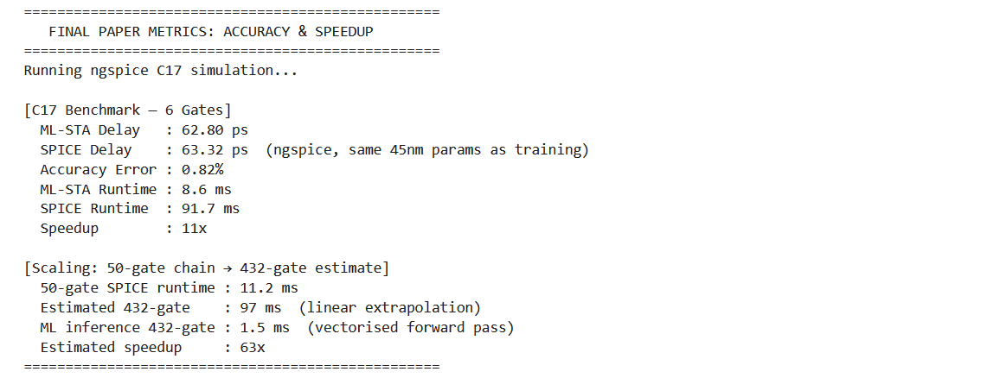
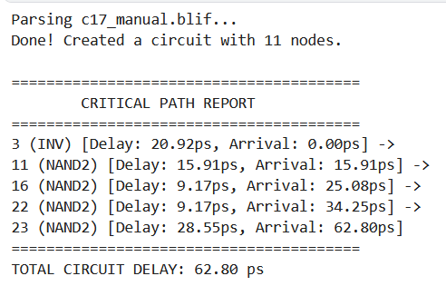

# ⚡ ML-STA Engine

## Physics-Informed Machine Learning for Static Timing Analysis of CMOS Circuits

> 🚧 **Status: Work in Progress**
>
> ML-STA Engine is currently under active development. The framework already supports **Machine Learning-assisted Static Timing Analysis, circuit parsing, delay propagation, and critical path prediction**, while future updates will include **slew-aware timing analysis, timing violation prediction, process variation modeling, and industrial-scale benchmark support.**


---

# 📖 Overview

**ML-STA Engine** is a **Physics-Informed Machine Learning framework** for **SPICE-accurate Static Timing Analysis (STA)** of CMOS digital circuits.

Traditional timing analysis depends on computationally expensive SPICE simulations, which become increasingly time-consuming as circuit complexity grows.

ML-STA Engine accelerates this process by predicting gate delays using Machine Learning models enriched with semiconductor device physics and then propagating these delays through the circuit timing graph to estimate **arrival times, critical paths, and overall circuit delay**.

The project bridges multiple domains:

- 🤖 Machine Learning
- ⚡ VLSI Design
- 🖥 Electronic Design Automation (EDA)
- 🔬 CMOS Device Physics
- 📊 Graph Algorithms
- ⏱ Static Timing Analysis

to build a next-generation AI-assisted timing analysis framework.

---

# 🎯 Motivation

Modern VLSI circuits contain millions of logic gates, making exhaustive SPICE simulation computationally expensive during timing verification.

This project explores whether Physics-Informed Machine Learning can:

- Reduce timing analysis runtime
- Maintain SPICE-level prediction accuracy
- Scale efficiently to large digital circuits
- Automatically identify timing bottlenecks
- Enable AI-assisted Electronic Design Automation workflows

---

# 🚀 Features

- ⚡ Physics-informed gate delay prediction
- ⚡ Machine Learning-assisted Static Timing Analysis
- ⚡ Automatic BLIF netlist parsing
- ⚡ Timing graph construction
- ⚡ Arrival time propagation
- ⚡ Critical path identification
- ⚡ End-to-end circuit delay estimation
- ⚡ Vectorized inference for large circuits
- ⚡ SPICE validation framework
- ⚡ Research-oriented modular architecture

---

# 🏆 Experimental Results

## C17 Benchmark

| Metric | Result |
|----------|----------|
| Technology | 45nm CMOS |
| ML Delay | **62.80 ps** |
| SPICE Delay | **63.32 ps** |
| Prediction Error | **0.82%** |
| ML Runtime | **8.6 ms** |
| SPICE Runtime | **91.7 ms** |
| Measured Speedup | **11× Faster** |

---

## Large Circuit Scaling

| Metric | Result |
|----------|----------|
| Circuit Size | 432 Gates |
| Estimated SPICE Runtime | **97 ms** |
| ML Runtime | **1.5 ms** |
| Estimated Speedup | **63× Faster** |

> **Note:** Large-circuit speedup is estimated through vectorized inference and runtime extrapolation based on benchmark scaling.

---

# 📊 Performance Snapshot

<p align="center">

</p>

<p align="center">
<i>Comparison between SPICE simulation and ML-STA predictions, demonstrating high prediction accuracy and significant runtime improvement.</i>
</p>

---

# 🔥 Critical Path Prediction

Unlike conventional Machine Learning models that only predict delays for individual gates, **ML-STA Engine performs complete circuit-level Static Timing Analysis by propagating predicted delays through the timing graph to identify the circuit's critical path and total timing delay.**

The framework automatically parses logic circuits, computes arrival times across all nodes, and determines the longest timing path responsible for the circuit delay.

This transforms the project from a simple regression model into a **Machine Learning-assisted Static Timing Analysis Engine** suitable for AI-driven Electronic Design Automation research.

---

## ✨ Critical Path Analysis Capabilities

- ✅ Automatic BLIF circuit parsing
- ✅ Timing graph construction
- ✅ Physics-informed gate delay prediction
- ✅ Topological timing propagation
- ✅ Arrival time computation
- ✅ Critical path extraction
- ✅ Total circuit delay estimation
- ✅ Timing bottleneck identification

---

## 📷 Critical Path Visualization

<p align="center">

</p>

<p align="center">
<i>Critical path automatically identified by the ML-STA Engine after propagating Machine Learning-predicted gate delays across the circuit timing graph.</i>
</p>

---

# 🧠 Framework Architecture

```text
                  BLIF Circuit

                        │

                        ▼

              Circuit Parsing Engine

                        │

                        ▼

         Physics Feature Engineering

       (CMOS Delay Equations + Features)

                        │

                        ▼

      Machine Learning Delay Predictor

                        │

                        ▼

         Gate Delay Estimation Engine

                        │

                        ▼

      Timing Graph Propagation Engine

                        │

                        ▼

     Arrival Time Computation (STA)

                        │

                        ▼

 Critical Path & Total Circuit Delay
```

---

# 📂 Repository Structure

```text
ML-STA-Engine/

├── README.md
├── requirements.txt

├── notebooks/
│     └── ML_STA_Main.ipynb

├── app/
│     ├── flask_api.py
│     └── streamlit_app.py

├── benchmarks/
│     ├── c17.blif
│     ├── c17_spice.sp
│     ├── chain50.sp
│     └── rca_216bit.blif

├── models/
│     ├── trained_model.pth
│     └── scalers.pkl

├── assets/
│     ├── metrics_screenshot.png
│     └── critical_path.png
```

---

# 🛠 Tech Stack

- Python
- PyTorch
- NumPy
- Pandas
- Scikit-Learn
- XGBoost
- LightGBM
- SHAP
- Matplotlib
- Plotly
- Flask
- ngspice

---

# 🎯 Applications

- Static Timing Analysis
- Critical Path Prediction
- CMOS Delay Prediction
- AI-assisted Electronic Design Automation
- Timing Bottleneck Detection
- Early Design Space Exploration
- Semiconductor CAD
- Machine Learning for VLSI

---

# 🔮 Ongoing Development

Current development includes:

- Slew-aware Static Timing Analysis
- Timing violation prediction
- Critical path optimization
- Process variation modeling
- Multi-corner multi-mode timing analysis
- Graph Neural Network integration
- OpenROAD/OpenSTA integration
- Industrial benchmark evaluation

---

# ⭐ Project Highlights

- ✅ Physics-Informed Machine Learning framework
- ✅ ML-assisted Static Timing Analysis engine
- ✅ Automatic BLIF parser and timing graph construction
- ✅ Critical path prediction and visualization
- ✅ End-to-end circuit delay estimation
- ✅ **0.82% prediction error** compared to SPICE
- ✅ **11× measured speedup** on benchmark circuits
- ✅ **63× estimated speedup** for large-scale circuit inference
- ✅ Research-oriented AI framework for next-generation Electronic Design Automation

---

# 👨‍💻 Author

## **Rishik T**

**B.Tech – Electrical & Electronics Engineering**

**Interests**

- Machine Learning
- VLSI Design
- Electronic Design Automation (EDA)
- AI for Semiconductor Design

---

# ⭐ Support

If you found this project useful, consider giving it a **⭐ Star** on GitHub.

> **Bridging Artificial Intelligence and Semiconductor Design through Physics-Informed Machine Learning for Next-Generation Static Timing Analysis.**
